# Uplift-model

## Why uplift model & Case Background Info
To calculate the increase amount brought by certain actions, since in real life, we cannot calculate the incrementality for one single user. 

This project is AU C2C seller campaign targeting Strategy Optimization. 
Our platform will send coupons to sellers to encourage them to add more listings. 
Our challenge here is to prevent revenue loss for FVF(final value fee discount) cap. So our main purpose here is to only target those persuadable customers(with highest persuadable likelihood score).  
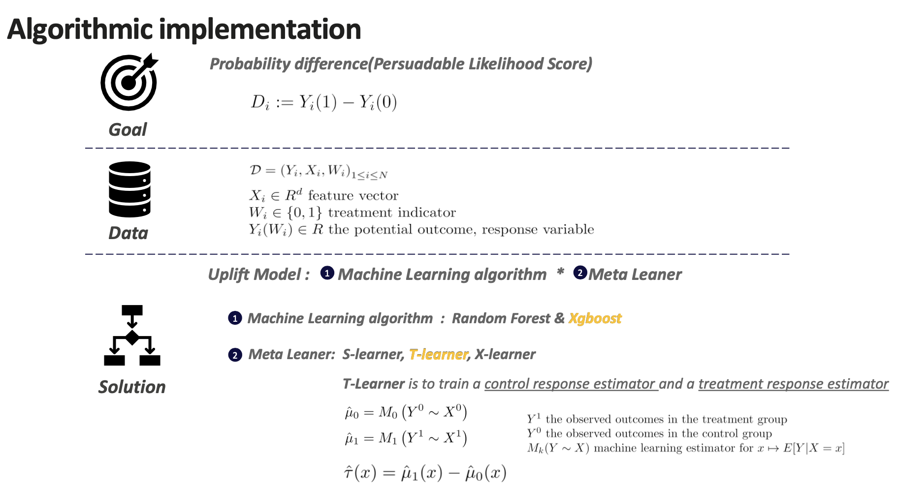

To simply summarize the differences between s-learner, t-learner and x-learner:
- T-learner: 
build models for both treatment and control groups and calculate the difference. Calculate the listing probability of samples in test set when given a treatment based on model from train set in treatment group and also calculate probability when not given a treatment based on model from train set in control group. This model is simple and direct and can use any single model, for example, LR, SVM, NN. 
But this model will increase the variances of two models and when multiple treatments exist, we need to train several models. 
- S-learner: 
use whether we apply treatment or not to as a new label to build one single model. 
- X-learner:
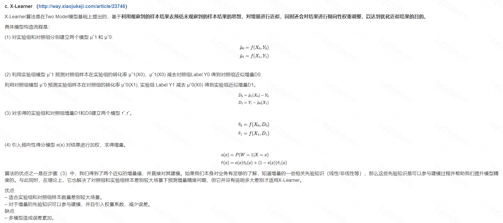

## Metrics to evaluate the model
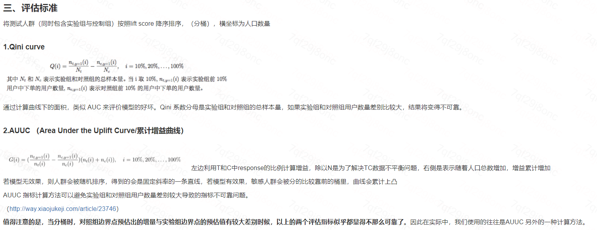
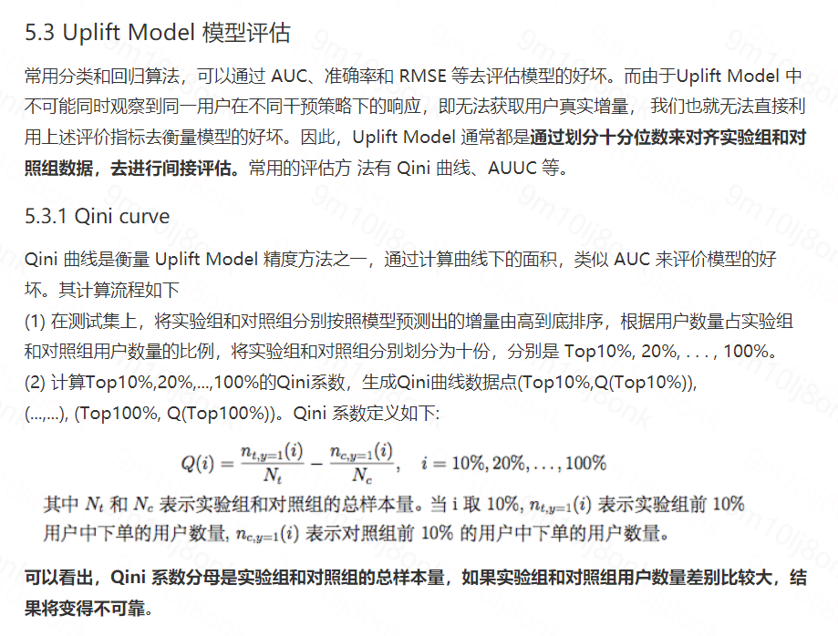
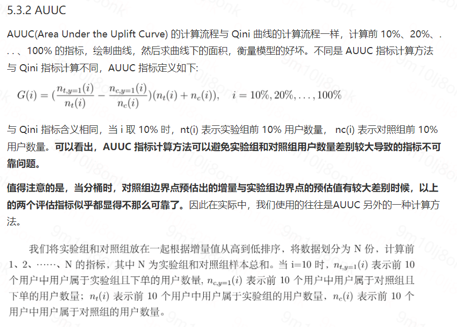

## Application in this case

#### Problem formulation from an abstract point of view
The Uplift Model aims to compute a score for each seller: propensity[list if promo] - propensity[list if no promo] and to target the top k% of the users (k is adjusted based on KPIs value)
CATE(Conditional Average Treatment Effect):the expected value of the ITE, conditional on some predictors 
 CATE = E[ ITE | X = x ] = E[Y(1) – Y(0) | X = x ]
= Prob(X = T) * E[ Y(1) – Y(0) | X = T ] + Prob(X = C) * E[ Y(1) – Y(0) | X = C ]
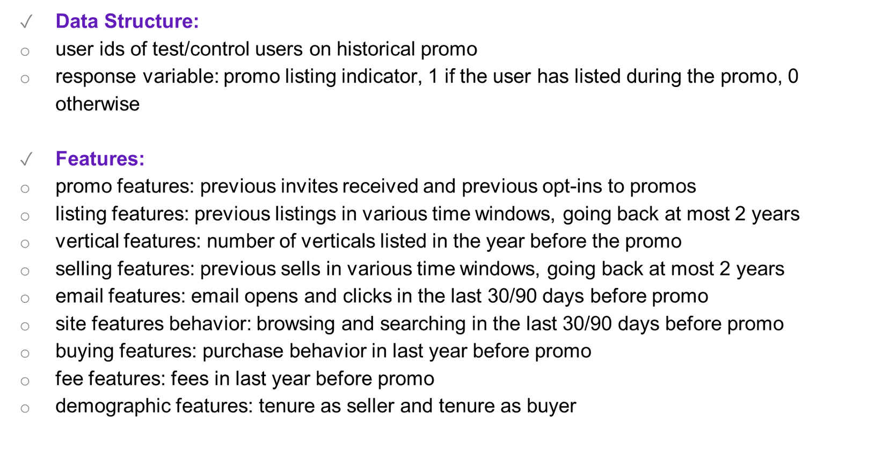
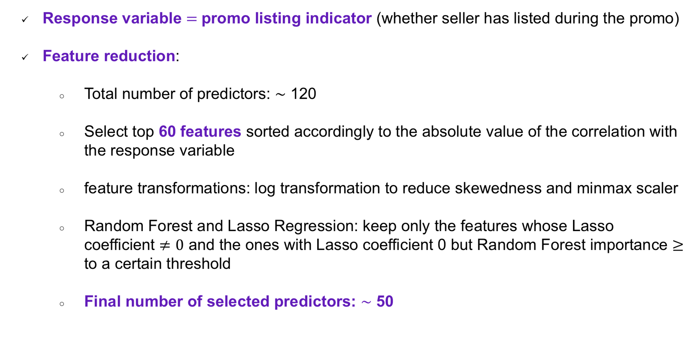

Phase1 -- Training of the two X learners: Random Forest classifier
From the training datasets to the vectors of features values and of response values
CATE = E[ ITE | X = x ] = E[Y(1) – Y(0) | X = x ]
= Prob(X = T) * E[ Y(1) – Y(0) | X = T ] + Prob(X = C) * E[ Y(1) – Y(0) | X = C ]
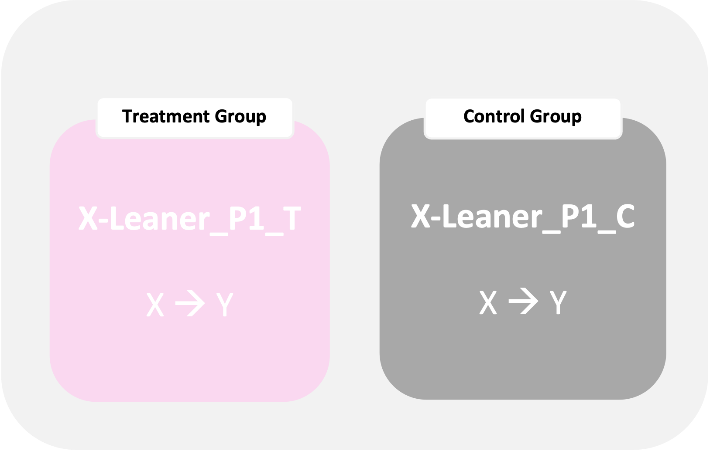
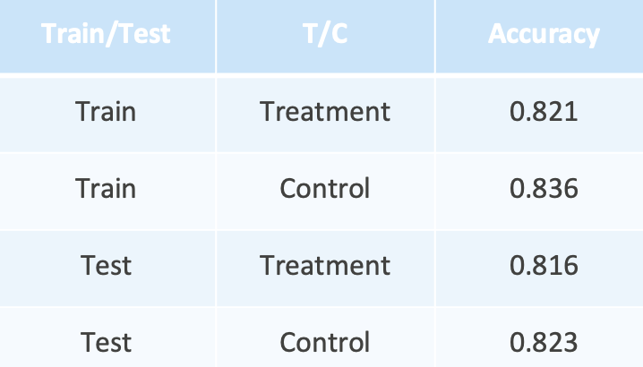

Phase2 -- Imputed Treatment Effect: Random Forest regressor to predict the cate
CATE = E[ ITE | X = x ] = E[Y(1) – Y(0) | X = x ]= Prob(X = T) * E[ Y(1) – Y(0) | X = T ] + Prob(X = C) * E[ Y(1) – Y(0) | X = C ]
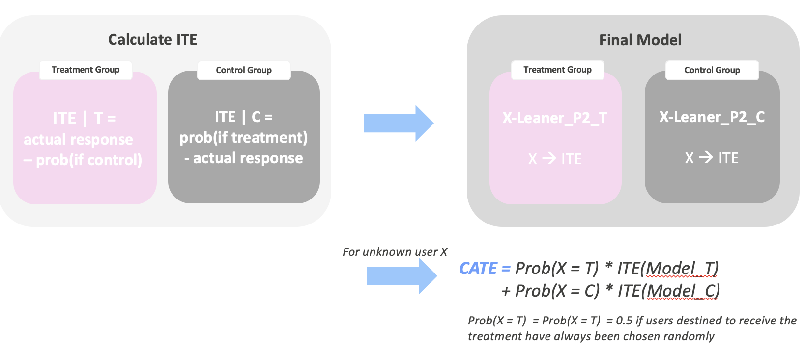

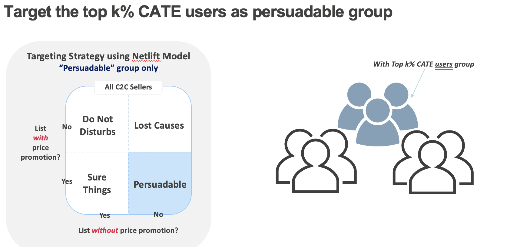

Promising read-out noticed from first simulation test on early-May Mega weekend. Identified 0.1% of all targeted sellers performed 25 times better than others in terms of listing uplift, 13 times better referring to GMV uplift, and significantly higher investment ROI (15% vs -4%).
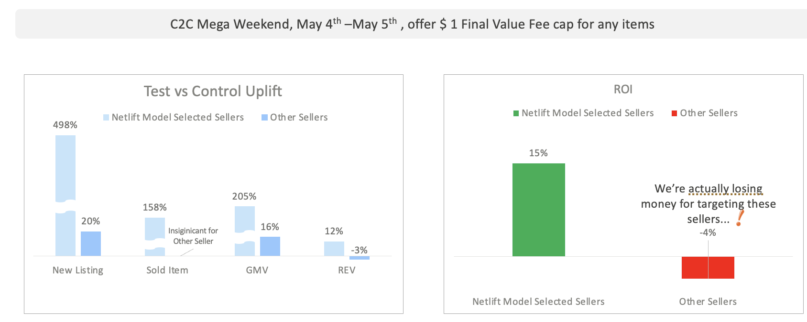
Extremely promising read-out noticed from first simulation test on early-May Mega weekend. Identified 0.1% of targeted sellers contributed to 68% of total iGMV and 86% total iListings, and 15% ROI (2 times to previous all targeting)
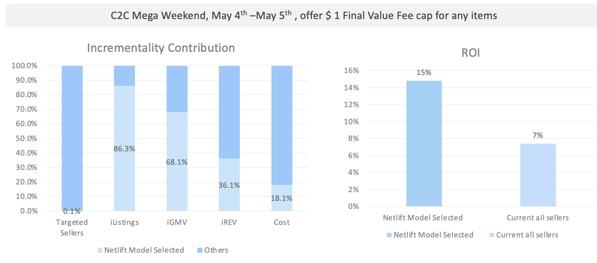

#### To-do in the future
Can Netlift model approach be applied on retail promotion (buyer side)? 
Theoretically it can be applied to all kinds of campaign designs.

What process is needed to validate the efficiency of adopting this approach? 
Need clean experimentation data as training set. There will be one retail promo experimentation planned in early Aug, with 90% traffic being offered with coupon and 10% hold as control group. 
Model simulation and iteration to validate the approach efficiency.
